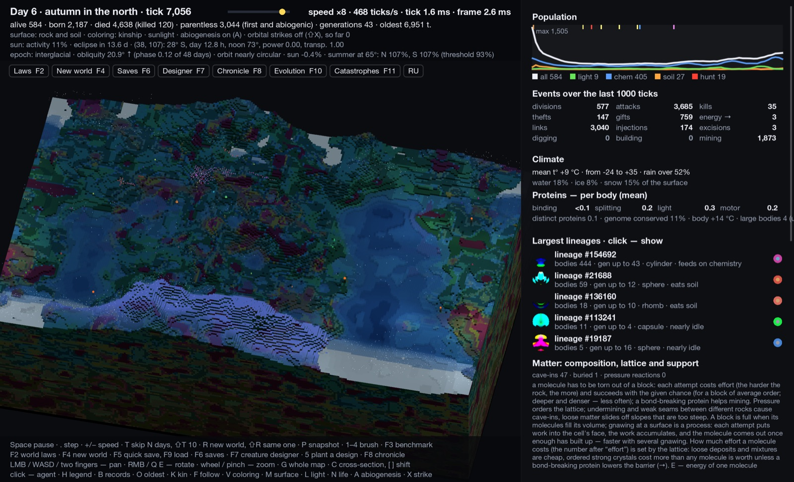
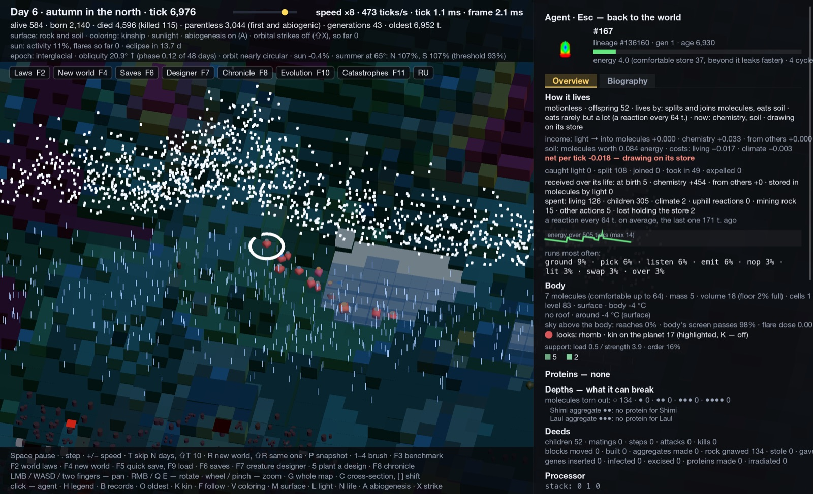
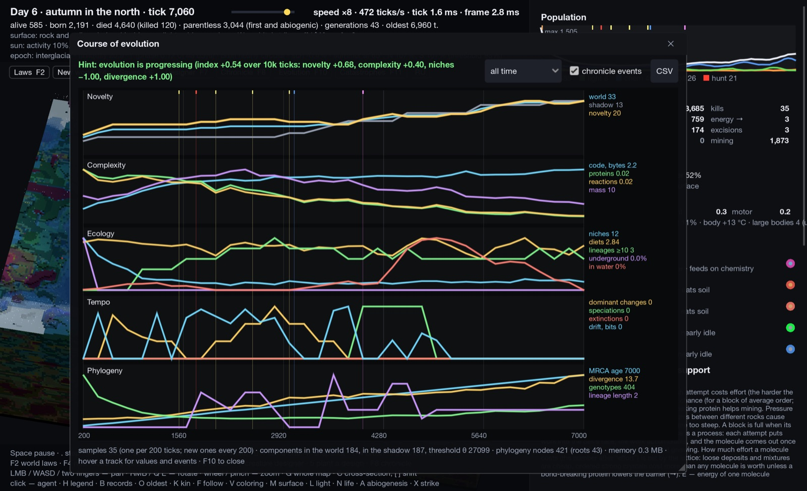
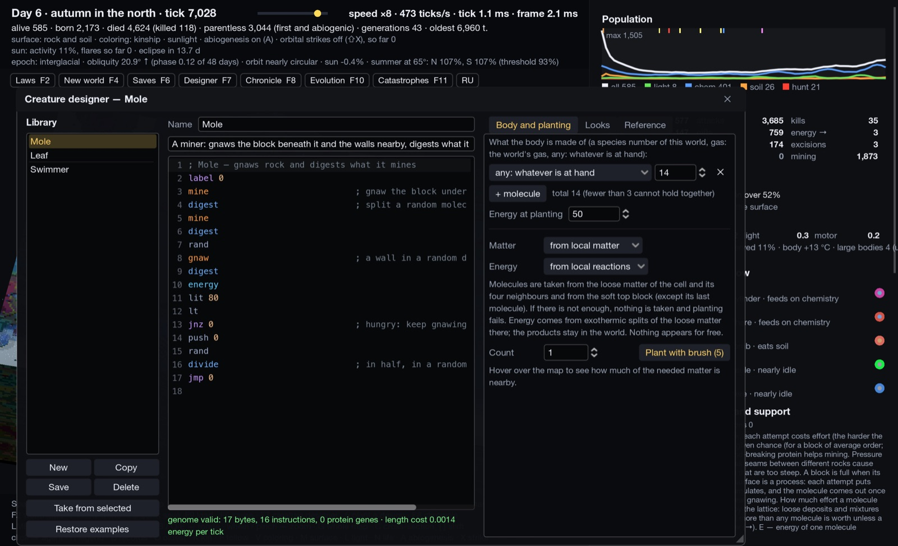
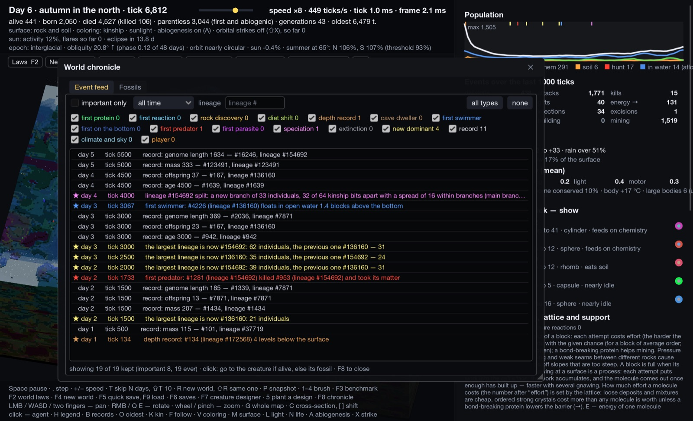
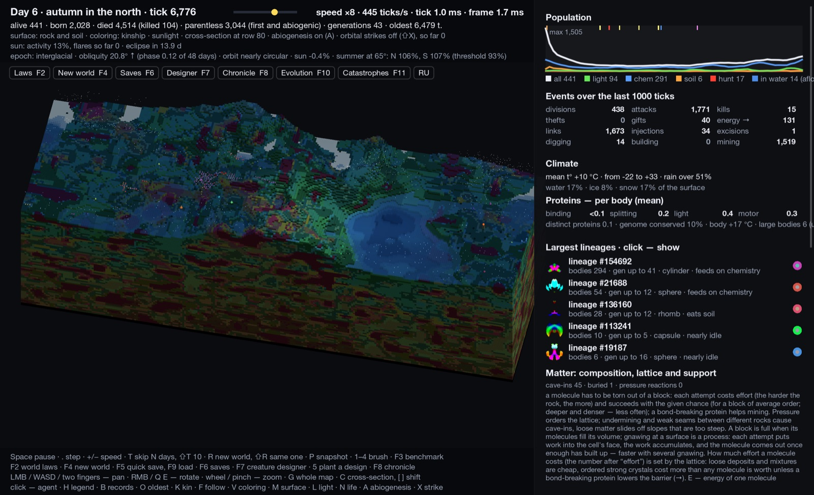
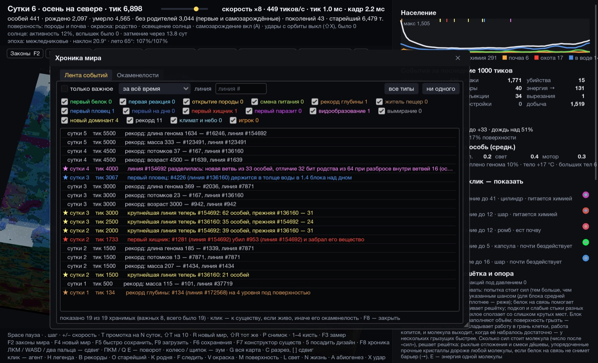

<div align="center">

# Primordium

**A procedural artificial-life sandbox where chemistry, geology and evolution are simulated — not scripted.**

[](https://godotengine.org)
[](https://dotnet.microsoft.com)
[](LICENSE)


**English** · [Русский](README.ru.md)



</div>

Every world is grown from a seed: its own artificial elements, its own molecules, its own rocks and strata. Creatures run random genomes on a small virtual machine. Proteins, reactions, feeding, movement and reproduction only *mean* something because selection makes them matter. There are no built-in "plants", "predators", "sand" or "clay" — whatever appears, evolved.

## Highlights

- 🧪 **Procedural chemistry.** Four artificial elements per world, 32 molecular species, with masses, affinity, valence and packing. Every reaction conserves atoms exactly; energy is a strict ledger, audited every run.
- 🪨 **Physical geology.** A 256 × 160 cylindrical planet up to 192 blocks deep by default (the size is a setting of the world). Rock has composition and lattice order. Load and Mohr–Coulomb strength decide what holds, so undermining causes cave-ins, rubble flows as a granular mass and buried remains change under pressure and heat.
- 🧬 **Evolving genomes.** A stack-machine genome with about 60 instructions: senses, enzymes, membranes, motors, mining, building, mating, attacks, colonies. Mutation inserts, deletes and duplicates code.
- 🌦 **Living climate and sky.** Seasons, day length by latitude, Milankovitch-style cycles (obliquity, precession, eccentricity), ice ages, eclipses, solar flares, volcanoes, cave microclimates.
- 📈 **Open-endedness metrics.** Bedau-style neutral shadow, novelty, complexity, ecology, tempo and phylogeny tracks, with an honest "progressing / stagnating / regressing" hint.
- 📜 **A chronicle of the world.** First proteins, first swimmers, the first predator, speciation and extinction, plus fossils you can resurrect.
- 🛠 **Play god, carefully.** Tune the 210 world laws live, design your own creatures in genome assembly, trigger catastrophes, save and load. Nothing appears for free: whatever you add is booked in the ledger.
- ⚙️ **Deterministic and fast.** Multithreaded checkerboard stepping with a reproducible trajectory: the same seed and laws give the same world on any run. A headless bench runs long experiments and statistical comparisons.

## Screenshots

<table>
  <tr>
    <td width="50%"><br><sub><b>Inspector.</b> How a body lives: its energy budget, proteins, what it can break, its deeds and the processor running its genome.</sub></td>
    <td width="50%"><br><sub><b>Course of evolution.</b> Novelty against the neutral shadow, complexity, ecology, tempo and phylogeny.</sub></td>
  </tr>
  <tr>
    <td><br><sub><b>Creature designer.</b> Write a genome in assembly, choose its body and plant it from local matter or bring it in from outside.</sub></td>
    <td><br><sub><b>Chronicle.</b> Firsts, records, speciation and new dominants; a click flies the camera to the creature or opens its fossil.</sub></td>
  </tr>
  <tr>
    <td><br><sub><b>Cross-section.</b> Strata, voids and caves under the surface.</sub></td>
    <td><br><sub><b>Two languages.</b> English by default; the <code>RU</code>/<code>EN</code> button at the bottom of the sidebar switches the whole interface.</sub></td>
  </tr>
</table>

## Getting started

**Requirements:** [Godot 4.3 .NET (mono)](https://godotengine.org/download/archive/4.3-stable/) and the [.NET 10 SDK](https://dotnet.microsoft.com/download).

```sh
git clone https://github.com/codder-cc/primordium.git
cd primordium
dotnet build
```

Then open `project.godot` in Godot 4.3 mono and press **Play**. A new world starts without life: press **N** to assemble creatures from local matter, **A** to turn on abiogenesis, or **F7** to plant your own design.

Useful launch flags (after `--`): `--seed N`, `--abio`, `--warm N` (pre-simulate N ticks), `--lang en|ru`, `--sidebar expanded|collapsed`, `--open laws,evolution,tree,metrics,matter,…`, `--shot path.png`.

```sh
Godot --path . -- --seed 3 --abio --warm 6000
```

## Controls

Every window and the main tools are also on the **sidebar** at the left edge: icons with tooltips (name, hotkey, what it does), open windows and the brush in hand highlighted. The chevron on top or **Tab** expands it to show names and hotkeys; the choice is kept in `ui.json` (`--sidebar expanded|collapsed` for screenshots).

| Key | Action |
|---|---|
| Tab | Collapse / expand the sidebar |
| Space / `.` | Pause / single tick |
| `+` / `−` | Simulation speed (the world runs on its own thread) |
| T / ⇧T | Skip N days / skip 10 days |
| LMB drag, WASD · RMB drag, Q / E · wheel, G | Pan · rotate · zoom, whole map |
| Click · K · F · O | Select a creature · highlight kin · follow · oldest |
| V · M · L · C, `[` `]` | Color mode · surface overlays (among them the ranges of clades) · sunlight · cross-section and its position |
| N · A · X | Assemble life from local matter · abiogenesis · orbital strike |
| 1–4 · 5 | Brushes (pour, water, kill, dig) · plant a design (or, from the life library, paste a population / copy the bodies in the circle) |
| U | Library of life: creature and population templates — copy a lineage, a clade or an area, save to `user://populations`, paste here or in another world |
| Z · ⇧Z · I | With brush 1: keep the material for every stroke · next material · take the exact recipe (molecules and lattice order) of the block under the cursor |
| J | Matter library: substances as recipes of this world's molecules — computed starters, samples from the world, your own compositions; brush 1 pours them, F11 sprays them; `user://materials` |
| F2 · F4 · F6 · F7 | World laws · new world · saves · creature designer |
| F5 / F9 | Quick save / quick load |
| F8 · F10 · F11 | Chronicle · course of evolution · catastrophes |
| F1 · F12 | Tree of life (cladogram of living clades, lineages over time) · metrics over time with CSV export |
| Y | Regions: select a rectangle on the map, copy it (with bodies) into a library, paste it turned here or in another world; JSON / binary export and import |
| F3 · R / ⇧R · P | Performance overlay · new seed / same seed · screenshot |

## Headless bench

The simulation core (`src/Sim`) does not depend on Godot. `tools/bench` runs it from the command line for tests and experiments:

```sh
dotnet run -c Release --project tools/bench -- --self-test                 # conservation, determinism, save/load, laws (~1 min)
dotnet run -c Release --project tools/bench -- --self-test-one RubbleRegression   # one part of it, timed
dotnet run -c Release --project tools/bench -- --seed 1 --size 64x64x64 --ticks 6000   # a small world (WxHxL; default 256x160x192)
dotnet run -c Release --project tools/bench -- --seed 1 --ticks 10000 --every 1000 --audit
dotnet run -c Release --project tools/bench -- --list-params               # all 210 world laws
dotnet run -c Release --project tools/bench -- --batch --seeds 1-16 --reps 3 --ticks 6000 --out runs/base
dotnet run -c Release --project tools/bench -- --compare runs/base/runs.csv runs/try/runs.csv
dotnet run -c Release --project tools/bench -- --batch ... --resume                  # after a crash: only the unfinished runs
dotnet run -c Release --project tools/bench -- --batch ... --shard 1/2 --machine a   # split a batch over machines, then:
dotnet run -c Release --project tools/bench -- --merge runs/all runs/a runs/b        # one runs.csv; hashes checked across machines
dotnet run -c Release --project tools/bench -- --punctuated runs/ice --control runs/ctrl   # tempo after catastrophes vs the same worlds without
dotnet run -c Release --project tools/bench -- --invade my_design.json --seeds 1-6   # plant a creature-designer file, follow its lineage
dotnet run -c Release --project tools/bench -- --seed 3 --ticks 2000 --copy-population pop.json         # copy the biggest lineage at the end
dotnet run -c Release --project tools/bench -- --seed 5 --plant-population pop.json --at 100,60 --audit   # paste it first (another chemistry is mapped); --local, --local-energy
dotnet run -c Release --project tools/bench -- --tournament --seed 2 --ticks 8000    # ancestors vs moderns in a copy of the world
dotnet run -c Release --project tools/bench -- --food-chain --seeds 1-2              # who eats whom: trophic levels, chain length
dotnet run -c Release --project tools/bench -- --perf-baseline --make                # once: make the reference boom save
dotnet run -c Release --project tools/bench -- --perf-baseline --ticks 2000 --repeat 3   # ms/tick by stage, median of 3, end hash
dotnet run -c Release --project tools/bench -- --seed 4 --audit --paste-region valley.region --at 100,40 --rotate 1   # paste a region file (made by the game or --copy-region x,y,w,h file)
```

`--batch` runs as many processes as there are performance cores by default (macOS: `hw.perflevel0.physicalcpu`), each world single-threaded (`--threads 1`, i.e. `DOTNET_PROCESSOR_COUNT=1`; same trajectory); every row of `runs.csv` carries the `machine` and the `code_version` (git commit). The evolution metrics also cover depth (`roofed_share`, `body_depth_*`, `mine_depth`), spatial heterogeneity over 32×32 regions (`pop_moran`, `diet_moran`, `diet_beta_rel`) and oscillation of diet shares against shuffled surrogates (`osc_*`, `hunt_*`; sample with `--every 100`–`250`).

**Two-stage batches.** `--size WxHxL` works for `--batch` and single runs. Screen many variants cheaply on small worlds (`--size 64x64x64`: ~1/30 of the voxels, a 6000-tick run in seconds; first bodies, volcanoes and strikes come in proportion to the area, so per-cell numbers are comparable, totals are not), then confirm the few that survive on full worlds (no `--size`) before deciding. Keep the height at 160 (`--size 64x160x96`) if latitude matters.

Tests build what they need: small worlds and scenarios (`tools/bench/Scenario.cs`: a flat floor, a cave, a lake of a given depth, a cliff, strata, two bodies side by side) instead of a whole planet; only what needs a planet (old save formats, the long worlds, determinism of parallel tiles) runs on one.

Decide on laws with batches, not single runs: `--compare` reports medians with bootstrap intervals, Mann–Whitney, a sign test across seeds and Fisher's test for extinctions and booms. Add `--lang ru` for Russian output. The full flag reference is in [README.ru.md](README.ru.md) and [docs/SIMULATION.md](docs/SIMULATION.md).

## How it works

| | |
|---|---|
| **Matter** | Molecules have composition vectors; reactions are allowed only when a product with the summed composition exists. Light excites a molecule without changing its atoms. Nothing turns energy into matter. |
| **Structure** | Load follows the strongest support path to grounded rock. Confinement strengthens strata, crushed rock bulks and flows downhill, and pressure packs it back with exponentially rising resistance. |
| **Life** | Eight VM steps per tick. Enzymes are encoded by the genome itself: catalysis type, target molecules, temperature optimum and efficiency. Proteins wear out, bodies need energy, and heat and frost hurt. |
| **Water** | Bodies sink without gas; gas in the body is a bubble, so intake and expel choose a depth. Light fades with depth. |
| **Threads** | Bodies step in parallel on 32 × 32 tiles in a checkerboard pattern under a strict locality contract, with the same trajectory as a serial run. |

The full model, with its limits and what is only approximated, is in **[docs/SIMULATION.md](docs/SIMULATION.md)**. The development log ([CHANGELOG](docs/CHANGELOG.md)) and [ROADMAP](docs/ROADMAP.md) are in Russian. Contributor rules are in [AGENTS.md](AGENTS.md).

## License

[MIT](LICENSE)
